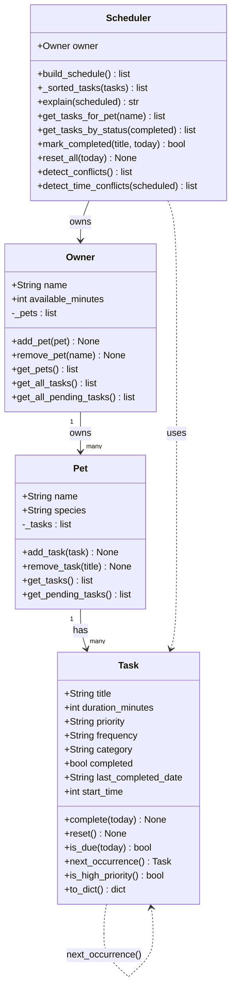

# PawPal+ Class Diagram

## Arrow Key

| Arrow | Meaning |
|-------|---------|
| `-->` | Solid arrow — ownership or composition. One object holds a direct reference to another. |
| `..>` | Dashed arrow — usage dependency. One object uses another temporarily but does not own it. |
| `"1" --> "1"` | One-to-one relationship (e.g. one Owner owns one Pet). |
| `"1" --> "many"` | One-to-many relationship (e.g. one Pet has many Tasks). |
