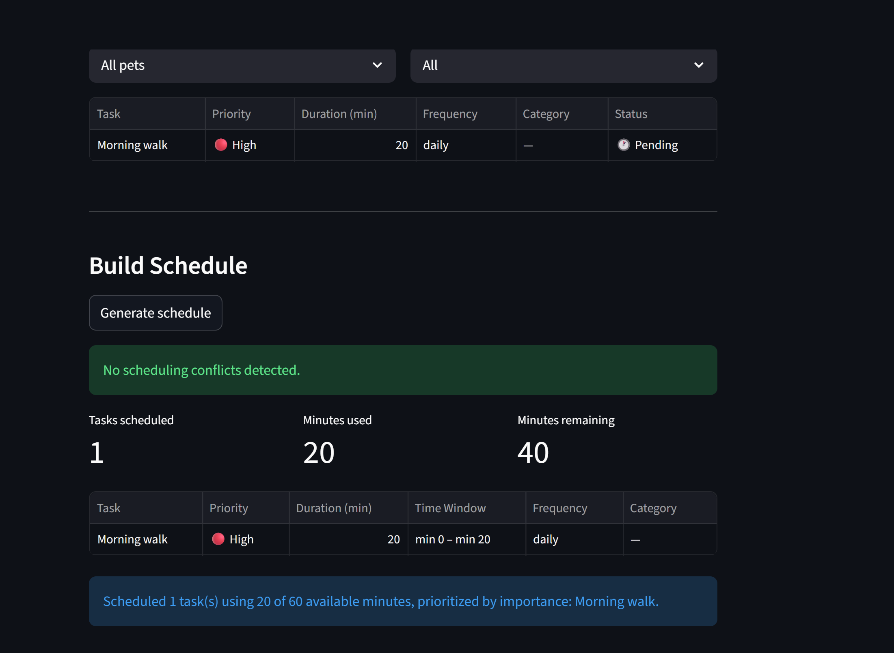

# PawPal+ Project Reflection

## 1. System Design

**a. Initial design**

The three core actions a user should be able to perform in PawPal+ are:

1. **Set up their pet profile** — A user should be able to enter basic information about themselves and their pet (name, pet type, time available per day) so the app understands the context and constraints it is working within.

2. **Add and manage care tasks** — A user should be able to create, edit, and remove pet care tasks (such as walks, feeding, or medication), specifying at minimum how long each task takes and how important it is, so the scheduler has the right inputs to work with.

3. **Generate and review a daily plan** — A user should be able to ask the app to produce a recommended daily schedule based on their available time and task priorities, and see a clear explanation of why those tasks were chosen and in what order.

- Briefly describe your initial UML design.
  - Five classes connected by ownership and usage relationships: Owner → Pet → Task, with a Scheduler that reads constraints from Owner and Tasks to produce a Schedule.
- What classes did you include, and what responsibilities did you assign to each?
  - **Owner** — stores the owner's name and daily time budget.
  - **Pet** — stores pet info and links the owner to their tasks.
  - **Task** — stores a single care activity (title, duration, priority, category).
  - **Schedule** — holds the ordered output of a scheduling run and an explanation.
  - **Scheduler** — sorts tasks by priority, fits them into the time budget, and produces a Schedule.

**b. Design changes**

- Did your design change during implementation?
  - Yes
- If yes, describe at least one change and why you made it.
  - Claude code helped me realize a scheduler object would be helpful and make sure that tasks are sorted properly and make sense within the overall schedule, helping make the app more organized
---

## 2. Scheduling Logic and Tradeoffs

**a. Constraints and priorities**

- What constraints does your scheduler consider (for example: time, priority, preferences)?
  - **Time budget** — the owner sets a daily available minutes value, and the scheduler will never exceed it. Tasks that do not fit are skipped entirely.
  - **Priority** — each task is labeled high, medium, or low. The scheduler always places high-priority tasks first so that critical care (medication, feeding) is not pushed out by optional activities.
  - **Duration** — within the same priority level, shorter tasks are scheduled before longer ones so that more tasks can fit into the remaining time.
  - **Completion status** — already-completed tasks are excluded from the schedule. Recurring tasks (daily/weekly) are automatically reset when they are due again, so they re-enter the schedule on the correct day without manual intervention.
- How did you decide which constraints mattered most?
  - Time and priority were the most important because they directly affect pet welfare — a pet cannot skip medication because the owner ran out of time. Duration as a tiebreaker and recurrence handling were added second because they improve how many tasks actually get done each day without changing the core priority logic.

**b. Tradeoffs**

- Describe one tradeoff your scheduler makes.
  - The scheduler uses a greedy, single-track algorithm: it sorts all tasks by priority (then shortest duration), then walks the list and assigns each task the next available time slot — one after another. This means `detect_time_conflicts()` will never report a conflict in a normally-built schedule, because tasks are placed sequentially by construction and cannot overlap. A more realistic model would build a separate time track per pet (so Dog A's walk and Cat B's feeding run in parallel), which would expose genuine conflicts when the owner cannot physically do two things at once.
- Why is that tradeoff reasonable for this scenario?
  - For a single owner managing one or two pets, a sequential schedule is simple to read and easy to follow — the owner just works down the list. The complexity of parallel per-pet tracks is not worth the added confusion for the target user. The `detect_time_conflicts()` method is still correct and useful: it is ready to catch real overlaps if start times are ever assigned manually or if a multi-track scheduler is added later, without any changes to its logic.

---

## 3. AI Collaboration

**a. How you used AI**

- How did you use AI tools during this project (for example: design brainstorming, debugging, refactoring)?
  - I used AI to write menial lines of code for me, focusing myself more on the bigger picture and direction of the project. I also used AI to help me spot inefficient lines of code and parts where the code could be improved.
- What kinds of prompts or questions were most helpful?
  - The most helpful prompts and questions were the ones where I was specific in what I wanted the AI to do without being too strict on the implementation, that way the AI was able to go about it in the most efficient manner

**b. Judgment and verification**

- Describe one moment where you did not accept an AI suggestion as-is.
  - One moment where I did not accept an AI suggestion as-is was when working through the actual implementation of the objects, the AI suggested making extra steps to make a product that would theoretically be better for the end user, but strayed away from the actual goals I was asking. Essentially adding extra features that could go wrong
- How did you evaluate or verify what the AI suggested?
  - I evaluated by reading through suggested code and making sure that the AI was not taking steps I did not need or want in the code

---

## 4. Testing and Verification

**a. What you tested**

- What behaviors did you test?
  - Sorting correctness — verified that scheduled tasks are assigned start times in ascending order and that same-priority tasks sort shorter-first. Recurrence logic — confirmed that completing a daily task spawns exactly one new pending instance that starts fresh. Conflict detection — checked that overlapping time windows are flagged, abutting tasks are not, duplicate titles warn, and high-priority tasks that exceed the budget trigger a warning.
- Why were these tests important?
  - These three areas are the core of the scheduler's value. If sorting is wrong, lower-priority tasks could block critical care. If recurrence breaks, daily tasks silently disappear after one completion. If conflict detection gives false positives or misses real issues, the owner gets misleading warnings. Getting these right is what makes the app trustworthy.

**b. Confidence**

- How confident are you that your scheduler works correctly?
  - Fairly confident — 25 tests cover the scheduling contract end to end and all pass. The main gap is the Streamlit UI layer, which has no automated tests, so visual or interaction bugs could still exist there.
- What edge cases would you test next if you had more time?
  - An owner with multiple pets where two pets share a task title, to confirm `mark_completed` targets the right pet. A weekly task completed exactly 6 days ago to make sure it does not reset early. And a schedule where `available_minutes` equals the duration of one task exactly, to confirm the boundary is inclusive.

---

## 5. Reflection

**a. What went well**

- What part of this project are you most satisfied with?
  - I was most satisfied by the fact that I learned how to use AI to work through longer projects with multiple steps and facets. 

**b. What you would improve**
- If you had another iteration, what would you improve or redesign?
  - I would improve the UI of the app, even though it works well the user has no choice but to click through multiple input fields to add details they want and have to scroll up and down, making it less user-friendly

**c. Key takeaway**

- What is one important thing you learned about designing systems or working with AI on this project?
  - One important thing I learned about designing systems is that it is important to understand that your initial UML may not accurately capture all the needed functions for a project, and that you should not waste time trying to predict every method you may need, instead using the UML to build relationships and have a map that you plan to follow, even if you will add in new items and maybe leave some stuff out

---

## Demo
